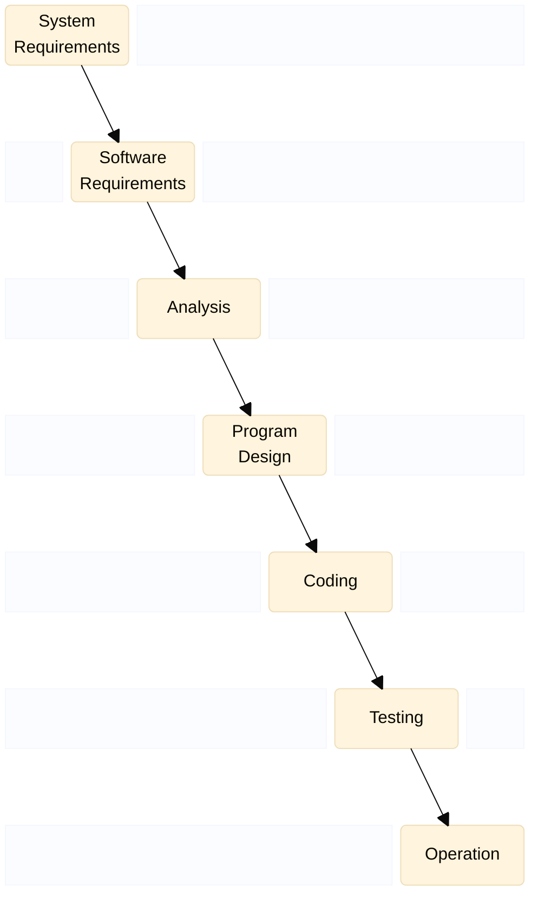
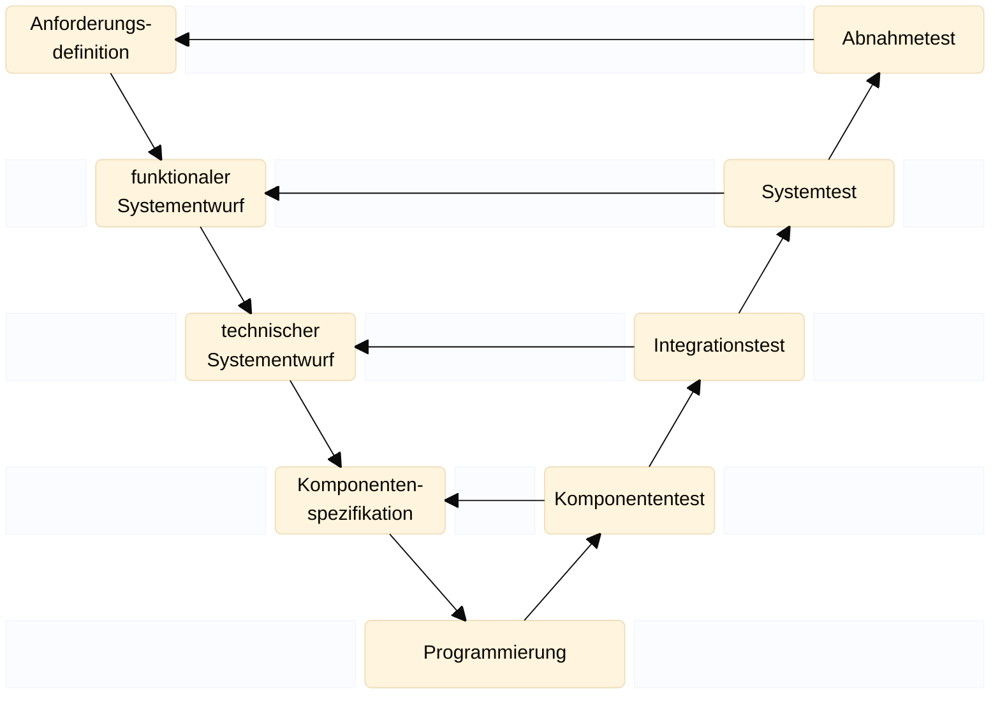

# Wasserfall

```mermaid
---
config:
    theme: 'base'
---
block-beta
    columns 8

    a("System\nRequirements"):2
    block:al:6 columns 6 end

    space:8

    block:bl:1 columns 1 end
    b("Software\nRequirements"):2
    block:br:5 columns 5 end

    space:8

    block:cl:2 columns 2 end
    c("Analysis"):2
    block:cr:4 columns 4 end

    space:8

    block:dl:3 columns 3 end
    d("Program\nDesign"):2
    block:dr:3 columns 3 end

    space:8

    block:el:4 columns 4 end
    e("Coding"):2
    block:er:2 columns 2 end

    space:8

    block:fl:5 columns 5 end
    f("Testing"):2
    block:fr:1 columns 1 end

    space:8

    block:gl:6 columns 6 end
    g("Operation"):2

    a --> b
    b --> c
    c --> d
    d --> e
    e --> f
    f --> g
```

# V-Modell

```mermaid
---
config:
    theme: base
    nodeSpacing: 100
---
block-beta
    columns 11

    a1("Anforderungs-\ndefinition"):2
    block:am:7 space end
    a2("Abnahmetest"):2

    space:11

    block:bl:1 space end
    b1("funktionaler\nSystementwurf"):2
    block:bm:5 space end
    b2("Systemtest"):2
    block:br:1 space end

    space:11

    block:cl:2 space end
    c1("technischer\nSystementwurf"):2
    block:cm:3 space end
    c2("Integrationstest"):2
    block:cr:2 space end

    space:11

    block:dl:3 space end
    d1("Komponenten-\nspezifikation"):2
    block:dm:1 space end
    d2("Komponententest"):2
    block:dr:3 space end

    space:11

    block:el:4 space end
    e("Programmierung"):3
    block:er:4 space end

    a1 --> b1
    b1 --> c1
    c1 --> d1
    d1 --> e
    e --> d2
    d2 --> c2
    c2 --> b2
    b2 --> a2

    a2 --> a1
    b2 --> b1
    c2 --> c1
    d2 --> d1
```