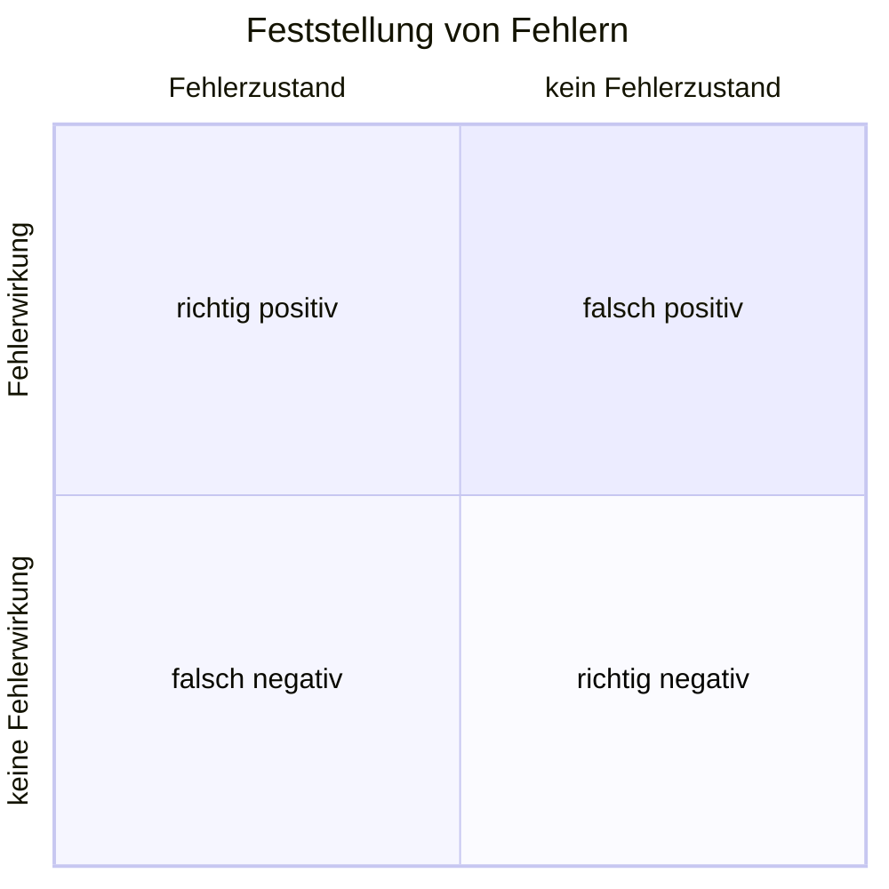

+++
date = '2025-08-17T15:29:40+02:00'
title = 'Der Fehlerbegriff'
weight = 2
+++

Anhand der Anforderungen und weiteren Informationen wird die _Testbasis_ bestimmt, welche das erwartete Verhalten beschreiben und als Grundlage für die Entscheidung dient, ob korrektes oder fehlerhaftes Verhalten vorliegt.

Ein _Fehler_ ist somit eine festgestellte Abweichung zwischen dem festgelegten Sollverhalten und dem beobachteten Istverhalten. Solche Fehler entstehen nicht durch Alterung oder Verschliess, sondern sind vom Zeitpunkt der Entwicklung an Teil der Software, auch wenn sie erst später entdeckt werden.

Wird die Fehlfunktion für den Anwender oder Tester sichtbar, spricht man von einer _Fehlerwirkung_ (engl. _failure_). Zwischen Ursache, die ihren Ursprung im _Fehlerzustand_ (engl. _fault_) der Software hat, und dem Auftreten der Fehlerwirkung muss unterschieden werden.

Ein Fehlerzustand kann durch andere Fehlerzustände in der Software kompensiert werden, was als _Fehlermaskierung_ bezeichnet wird. Durch die Korrektur eines maskierenden Fehlers können bisher verborgene Fehlerzustände an den Tag treten. Ein Fehlerzustand kann erst verspätet oder andernorts in der Software zu einer Fehlerwirkung führen, etwa bei der Verfälschung gespeicherter Daten.

Fehlerzustände entstehen durch die _Fehlhandlung_ einer Person (engl. _error_) und können verschiedene Gründe haben:

- Unvollkommenheit des Menschen
- hohe Komplexität von Aufgaben, Architektur, Design und Code
- hoher Zeitdruck
- Missverständnisse und Fehlinterpretationen der Anforderungen
- mangelnde Erfahrung oder Ausbildung der Beteiligten
- Ablenkung, Unkonzentriertheit und Müdigkeit

Eine Fehlhandlung einer Person führt zu einem Fehlerzustand im Programmcode, der zu einer Fehlerwirkung in der Software führt, die durch das Testen aufgezeigt werden soll.

Wird beim Testen eine Fehlerwirkung festgestellt, ohne dass ein Fehlerzustand im Testobjekt vorliegt, spricht man von einem _falsch positiven Ergebnis_ (engl. _false positive result_). Wird bei vorhandenem Fehlerzustand keine entsprechende Fehlerwirkung entdeckt, liegt ein _falsch negatives Ergebnis_ (engl. _false negative result_) vor. Wird der Fehlerzustand durch eine Fehlerwirkung erkannt, ist das Ergebnis _richtig positiv_; liegt kein Fehlerzustand vor und wird auch keine Fehlerwirkung erkannt, ist das Ergebnis _richtig negativ_.

Durch die Analyse der zugrundeliegenden Fehlhandlungen zu aufgedeckten Fehlerzuständen können Erkenntnisse gewonnen werden, womit der Entwicklungsprozess verbessert und die Wiederholung der Fehlhandlung vermieden werden kann.

Da zunächst nur die Fehlerwirkung und nicht der ihr zugrundeliegende Fehlerzustand bekannt ist, muss die fehlerhafte Stelle in der Software zuerst lokalisiert werden. Diesen Vorgang bezeichnet man als _Debugging_. Beim Testen werden also Fehlerwirkungen aufgedeckt, beim Debugging werden die zugrundeliegenden Fehlerzustände lokalisiert.

Durch die Behebung des Fehlerzustands wird die Qualität der Software verbessert ‒ sofern bei dieser Korrektur keine neuen Fehlerzustände eingebaut werden. Ein erneuter Test nach der Fehlerkorrektur wird als _Fehlernachtest_ bezeichnet. Da bei der Fehlerkorrektur aber auch neue Fehler eingebaut werden können, die unter anderen Eingabekonstellationen eine Fehlerwirkung erzeugen, müssen noch weitere Tests durchgeführt werden, und nicht nur derjenige, der die Fehlerwirkung ursprünglich provozierte.

## Fragen

1. Was bedeuten die Begriffe _Fehler_, _Fehlerwirkung_ und _Fehlerzustand_ und wie hängen diese zusammen?
2. Was ist eine _Fehlermaskierung_ und was wäre ein mögliches Beispiel dafür?
3. Wie gelangen Fehler in eine Software?
4. In welche vier Kategorien können Ergebnisse beim Testen eingeteilt werden?
5. Was ist die Ausgangslage und das Ziel beim _Debugging_?
