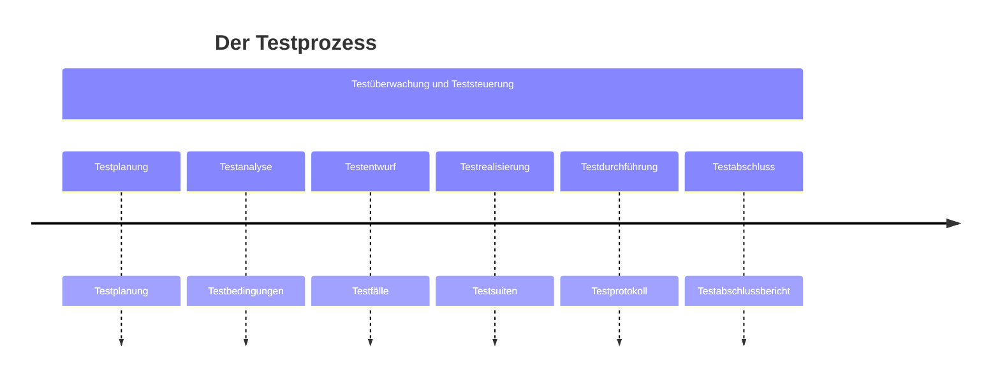

+++
date = '2025-08-24T12:31:19+02:00'
title = 'Der Testprozess'
weight = 4
+++

Unabhängig vom gewählten Entwicklungsmodell müssen Testarbeiten in kleinere Arbeitsschritte gegliedert werden. Ein Testprozess besteht aus verschiedenen _Testaktivitäten_, welche unabhängig vom konkreten Projekt in einer _Teststrategie_ festgelegt werden.

Die im folgenden beschriebenen Testaktivitäten müssen nicht streng sequenziell aufeinander folgen, sondern können sich zeitlich überlappen. Die Testüberwachung und -steuerung findet parallel zu den anderen sechs Testaktivitäten statt. In der agilen Softwareentwicklung finden diese Testaktivitäten kontinuierlich und iterativ statt.

## Testplanung

Die Testarbeiten werden von Beginn des Softwareentwicklungsprojekts an geplant und im weiteren Verlauf regelmässig überprüft und wenn nötig angepasst. Auf Basis einer Teststrategie wird ein _Testkonzept_ erarbeitet, welches den _Testprozess_ beschreibt.

Neben den Testobjekten und den nachzuweisenden Qualitätsmerkmalen wird festgehalten, welche Testaktivitäten welche Testziele nachweisen sollen. Auch benötigte Ressourcen und eine Zeitplanung sind Teil der Testplanung. Es werden Kriterien festgelegt, wann mit dem Testen angefangen werden kann (_Definition of Ready_) und wann eine Testaktivitäten als abgeschlossen gilt (_Definition of Done_).

Wie in jedem Konzept müssen auch mögliche Risiken aufgeführt werden. Informationen über die Testbasis und wie Änderungen daran sich auf die Testaktivitäten auswirken, gehören auch ins Testkonzept. Für die verschiedenen Tests sind die jeweiligen Teststufen aufzuführen. Im _Testzeitplan_ werden Akivitäten mit Start- und Endtermin sowie mögliche Abhängigkeiten zwischen diesen Tätigkeiten festgehalten.

## Testüberwachung und Teststeuerung

Die laufenden Testaktivitäten werden kontinuierlich im Vergleich zur Planung beobachtet. Abweichungen werden gemeldet, damit Gegenmassnahmen ergriffen werden können um das Erreichen der Testziele zu gewährleisten. Die Testplanung wird dabei aktualisiert.

Die Überwachung orientiert sich an den festgelegten Endkriterien zu den einzelnen Testaktivitäten. Können die durchgeführten Tests die Endkriterien nicht erfüllen, müssen zusätzliche Tests entworfen und durchgeführt werden.

Im _Testfortschrittsbericht_ wird der Testfortschritt im Vergleich zur Planung an die Stakeholder gemeldet. Beim Erreichen von Meilensteinen können auch _Testabschlussberichte_ angefertigt werden. Alle Testberichte sollen zielgruppengerecht über den Testfortschritt mit allen relevanten Details informieren, wobei auch geplante und tatsächliche Aufwände und Ressourcennutzung ausgewiesen werden. Als Grundlage hierzu dienen Berichte von Mitarbeitern aber auch erhobene Zahlen sowie durch Werkzeuge erstellte Auswertungen.

## Testanalyse

Hier wird ermittelt, _was_ zu testen ist. Dazu werden aus der Testbasis testbare Merkmale des Testobjekts ermittelt und daraus _Testbedingungen_ abgeleitet. Dabei orientiert man sich am gefordeten _Überdeckungsgrad_ (_Wie viel muss abgedeckt werden?_) und an den Risiken (_Wie soll priorisiert werden?_).

Die Testbasis soll hierzu genau überprüft werden, denn aus einer fehlerhaften oder widersprüchlichen Testbasis können keine sinnvollen Testbedingungen abgeleitet werden. Die durchzuführenden Tests müssen dann nachweisen, ob das Testobjekt diese Bedingungen erfüllt. Das Testobjekt muss über eine diesen Tests zugängliche Schnittstelle verfügen.

Es muss zwecks Nachverfolgbarkeit _bidirektional_ festgehalten werden, welche Testbedingungen welche Anforderungen prüft bzw. welche Anforderungen durch welche Testbedingungen geprüft werden. Gedanken über zu verwendende Testverfahren können in dieser Phase auch hilfreich sein.

## Testentwurf

In dieser Phase wird ermittelt, _wie_ zu testen ist. Aus den Testbedingungen werden _Testfälle_ abgeleitet. Ein _abstrakter Testfall_ verwendet dazu Bedingungen, denen die Eingabewerte genügen müssen (z.B. $1000 \le x < 1500$), während ein _konkreter Testfall_ exakte Eingabewerte festlegt (z.B. $x=1250$). Abstrakte Testfälle müssen vor der Testdurchführung konkretisiert werden, sind dafür aber besser für spätere Testzyklen wiederverwendbar.

Pro Testfall sind Ausgangssituation (Vorbedingung), einzuhaltende Randbedingungen (Invariante) und erwartete Ergebnisse (Endbedingung) inkl. erwarteter Seiteneffekte, wie z.B. veränderte persistente Daten, zu definieren. Für Testdaten müssen Anforderungen festgelegt werden. Die Sollwerte können aus der Testbasis abgeleitet oder teilweise auch anhand einer Umkehrfunktion (z.B. Test der Verschlüsselung durch Entschlüsselung) festgelegt werden.

Die Priorisierung und Verfolgbarkeit aus der Testanalyse kann nun auf einzelne Testfälle heruntergebrochen werden. Die _Testinfrastruktur_ bestehend aus Testumgebung, Testwerkzeugen und evtl. Testarbeitsplätzen muss ermittelt und bereitgestellt werden. Die _Testumgebung_ umfasst neben dem Testobjekt auch die dazu notwendige Hardware und teilweise auch weitere Hilfsmittel.

Anhand von _Überdeckungselementen_ ‒ aus Testbedingungen abgeleitete Eigenschaften unter Verwendung eines Testverfahrens ‒ werden Kriterien festgelegt, ab wann ausreichend getestet worden ist ‒ z.B. mindestens 50% durch Unit Tests abgedeckte Codezeilen.

## Testrealisierung

Diese Phase wird oft mit dem Testentwurf kombiniert. Hier sind alle Aktivitäten soweit vorzubereiten, dass die Testfälle in der nächsten Phase ausgeführt werden können.

Testmittel und Testinfrastruktur müssen bereitgestellt und geprüft werden. Testdaten müssen in die Testumgebung übernommen und ebenfalls überprüft werden. Testfälle müssen konkretisiert, zu Testsuiten gruppiert und in eine sinnvolle Reihenfolge gebracht werden, sodass die Nachbedingung eines Testfalls möglichst als Vorbedingung seines Nachfolgers genutzt werden kann. Auch die Priorisierung der Testfälle ist dabei zu beachten.

Eine Testsuite soll auch die Aufräumarbeiten nach den durchgeführten Testfällen berücksichtigen. Testskripte können diese Schritte automatisieren. Im Testausführungsplan werden die definierten Abläufe festgehalten.

## Testdurchführung

Nun gelangen die Testfälle gemäss _Testausführungsplan_ zur Ausführung. Zunächst empfiehlt es sich, die Hauptfunktionen des Testobjekts im Rahmen eines _Smoke-Tests_ zu überprüfen; sind diese bereits fehlerhaft, lohnt sich ein Weitertesten i.d.R. nicht.

Die ausgeführten Testfälle sind zu protokollieren, wozu folgende Angaben festgehalten werden: Testergebnis (bestanden, fehlgeschlagen oder blockiert, d.h. kann nicht ausgeführt werden), Tester, Testzeitpunkt und allenfalls Gründe für das Auslassen eines Testfalls.

Durch dieses Protokoll wird der Testvorgang für andere Parteien nachvollziehbar und die Umsetzung der gewählten Teststrategie kann damit nachgewiesen werden. Abweichungen zwischen erwarteten und tatsächlichen Testergebnissen werden ebenfalls protokolliert. Bei der Auswertung des Protokolls kann dann entschieden werden, ob eine Fehlerwirkung vorliegt. Beim Testen sollen auch die _Überdeckungsgrade_ gemessen und protokolliert werden; bei Bedarf auch der Zeitverbrauch.

Mithilfe der Verfolgbarkeit ‒ Testbasis, Testbedingungen, Testfälle, Testergebnisse ‒ kann nun nachvollzogen werden, welche Anforderungen erfüllt, teilweise erfüllt oder nicht erfüllt sind.

## Testabschluss

Der Zeitpunkt des Testabschlusses hängt vom verwendeten Entwicklungsmodell ab und kann auf die Freigabe einer Software oder eines Wartungsreleases, auf das Ende einer Iteration, auf den Abschluss eines Testprojekts oder auf einen sonstigen Meilenstein fallen.

Daten werden zusammengetragen, Erfahrungen ausgewertet und Testmittel zur Ablage gesichert (z.B. als Container-Images). Offene Fehler sind vollständig als Fehlerberichte gemeldet und werden in die nächste Iteration übernommen.

Die Testaktivitäten und deren Ergebnisse werden im _Testabschlussbericht_ zusammengefasst und so den Stakeholdern zur Verfügung gestellt. Je nach Branche muss von Gesetzes wegen ein Nachweis über die durchgeführten Tests erbracht werden.

In den Testaktivitäten gemachte Erfahrungen (z.B. Abweichungen zwischen Plan und Umsetzung) werden zwecks Erkenntnisgewinn für spätere Iterationen oder andere Projekte analysiert, wodurch der Testprozess an Reife gewinnt.

## Überblick

## Fragen

TODO