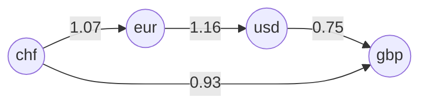

+++
date = '2025-12-11T10:09:56+01:00'
title = 'Testwerkzeuge'
weight = 14
+++

## Aufgabe 1: Testwerkzeuge kennenlernen

Mache dich mit den verschiedenen [Testwerkzeugen](/praxis/testwerkzeuge) vertraut, indem du versuchst die Beispiele nachzuvollziehen.

## Aufgabe 2: Währungsrechner kennenlernen

Erstelle einen Fork vom Repository [currency-converter](https://github.com/patrickbucher/currency-converter) und klone diesen.

Mache dich mithilfe der [README](https://github.com/patrickbucher/currency-converter/blob/master/README.md)-Seite mit der Verwendung des Servers und der Kommandozeilenanwendung vertraut.

## Aufgabe 3: Kommandozeilenwerkzeug testen

Schreibe ein Shell-Skript `cli-test.sh`, welches das Kommandozeilenwerkzeug `src/cli.ts` testet. Das Skript soll den Exit Code 0 zurückliefern, wenn alle Tests erfolgreich sind. Im Fehlerfall soll der Exit Code 1 zurückgeliefert werden.

Verwende für den Test die [Bash](/praxis/testwerkzeuge#bash) und optional [AWK](/praxis/testwerkzeuge/#awk).

Erstelle mindestens vier Testfälle:

1. Konversion mit einer bekannten Währung
2. Konversion mit einer anderen bekannten Währung
3. Konversion in die umgekehrte Richtung
4. Konversion mit einer unbekannten Währung (Negativtest)

Nimm das Testskript `cli-test.sh` in dein Repository auf.

## Aufgabe 4: Serveranwendung testen

Schreibe ein weiteres Shell-Skript `server-test.sh`, welches den Server `src/server.ts` testet. Das Skript soll wiederum im Erfolgsfall Exit Code 0 und andernfalls Exit Code 1 zurückliefern.

Verwende für den Test wiederum die [Bash](/praxis/testwerkzeuge#bash) und zusätzlich [curl](/praxis/testwerkzeuge/#curl) sowie [jq](/praxis/testwerkzeuge/#jq).

Es soll folgendes getestet werden:

1. Hinterlegen eines neuen Wechselkurses
2. Abrufen eines bekannten Wechselkurses
3. Abrufen eines unbekannten Wechselkurses (Negativtest)
4. Konversion mit einer bekannten Währung
5. Konversion in die umgekehrte Richtung
6. Entfernen eines Wechselkurses
7. Konversion für entfernte Währung (Negativtest)

Das Skript soll den Server selbständig im Hintergrund starten und nach erfolgtem Test wieder beenden.

Nimm das Testskript `server-test.sh` in dein Repository auf.

## Zusatzaufgabe (TDD): Währungsrechner erweitern

Der Währungsrechner kann nur zwischen zwei Währungen umrechnen, wenn deren direkter Wechselkurs bekannt ist. Angenommen es sind folgende Wechselkurse hinterlegt:

- `chf` zu `eur`: 1.07
- `eur` zu `usd`: 1.16
- `usd` zu `gbp`: 0.75

In diesem Fall kann zwar von `chf` auf `eur`, von `eur` auf `usd` und von `usd` zu `gbp` umgerechnet werden, jedoch nicht von `chf` zu `gbp`.

Dies wäre jedoch anhand der verfügbaren Informationen möglich, indem die Umrechnung in drei Schritten (`chf` zu `eur`, `eur` zu `usd`, `usd` zu `gbp`) vorgenommen wird:

```math
$$ r = 1.07 \times 1.16 \times 0.75 = 0.93 $$
```

Man kann sich die Umrechnungen als gerichteten Graph vorstellen:



Der Pfad von `chf` zu `gbp` ist jedoch nicht in der Anwendung abgebildet, sondern muss erst gefunden werden. Implementiere hierzu den folgenden Algorithmus:

1. Suche alle Umrechnungsraten mit der Ausgangswährung (z.B. `chf:*`).
2. Ermittle dazu die Zwischenwährung (z.B. `eur` für `chf:eur`).
3. Entspricht diese Zwischenwährung der Zielwährung, ist die Suche abgeschlossen.
4. Andernfalls muss die Suche bei Schritt 1 mit der Zwischenwährung fortgesetzt werden (z.B. `eur:*`).

Tipps:

- Merke dir bei diesem Abarbeiten der Umrechnungsarten jeweils den Pfad und die Umrechnungsraten in einer passenden Datenstruktur.
- Du musst dir auch merken, welche Umrechnungsarten bereits verarbeitet worden sind, damit die Suche nicht im Kreis verläuft.
- Implementiere eine rekursive Funktion, welche ein Array von Pfaden mitsamt Umrechnungsfaktoren beinhaltet.
- Gehe gemäss _Test-Driven Development_ vor und versuche den Algorithmus zuerst für ein einfacheres Beispiel zum Laufen zu bringen (z.B. von `chf` nach `usd`).
